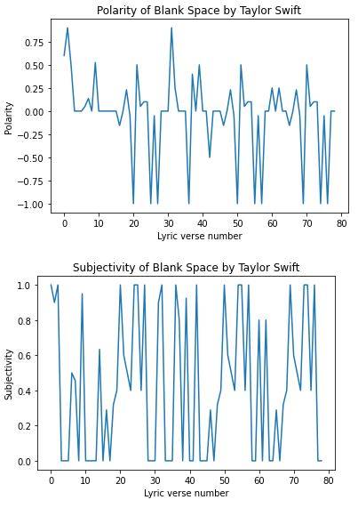

# Lyric-Sentiment
A short python application that uses natural language proccessing to analyze each verse in a song and returns a score in terms of polarity (from -1.0 to 1.0) and subjectivity (from 0.0 to 1.0). 

Using the user's input to get an artist and a track, the application retrieves lyrics from the [Apiseeds API](https://apiseeds.com/), [TextBlob](https://textblob.readthedocs.io/en/dev) library for NLP, and [matplotlib](https://matplotlib.org/) for plotting the changes of polarity/subjectivity over the course of the song.

## Installation
You will need [Python 3.8](https://www.python.org/) or greater, and [Anaconda](https://www.anaconda.com/) for access to easy data visualization libraries.

For the Apiseeds API, you will also need to make an account to get a free API key.

Once completed, open a new Jupyter Notebook file and copy the code into your own file. 
You may need to run additional commands to install dependencies such as the requests and TextBlob libraries.

Run these commands inside the notebook:
```bash
conda install -c anaconda requests
conda install -c conda-forge textblob
```

Now you will have everything you need to run the application. 
Press Kernel > Restart and Run All > Enter an artist name/track when prompted > See results plotted

## Example


